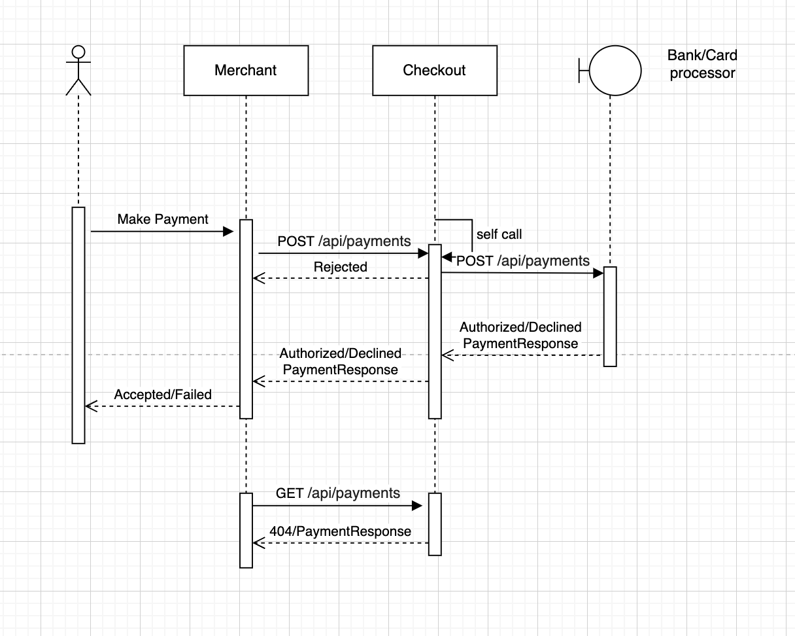
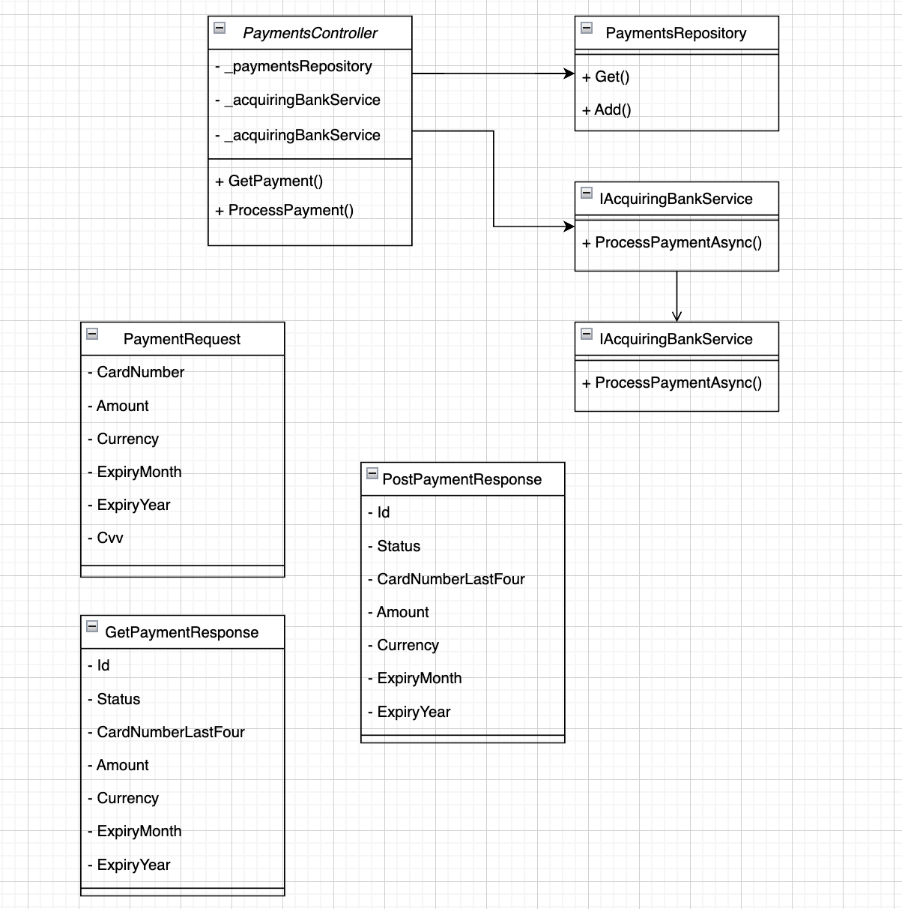

# Instructions for candidates

This is the .NET version of the Payment Gateway challenge. If you haven't already read this [README.md](https://github.com/cko-recruitment/) on the details of this exercise, please do so now. 

## Template structure
```
src/
    PaymentGateway.Api - a skeleton ASP.NET Core Web API
test/
    PaymentGateway.Api.Tests - an empty xUnit test project
imposters/ - contains the bank simulator configuration. Don't change this

.editorconfig - don't change this. It ensures a consistent set of rules for submissions when reformatting code
docker-compose.yml - configures the bank simulator
PaymentGateway.sln
```

Feel free to change the structure of the solution, use a different test library etc.

## Documentation

I have maintained the xunit test library and implemented the controller unit tests mocking the response from BankSimulator.

To run manual tests e2e run 

```
docker-compose up
cd /src/PaymentGateway.Api
dotnet run
```

Use curl or Postman to make API requests
```
curl --location --request POST 'https://localhost:{PORT}/api/payments' \
--header 'Content-Type: application/json' \
--data-raw '{
  "CardNumber": "2222405343248112",
  "ExpiryMonth": 1,
  "ExpiryYear": 2026,
  "Currency": "USD",
  "Amount": 60000,
  "Cvv": 456
}
```

### Architecture and flow

I have implemented a service interface, `IAcquireBankService`, which acts as a proxy to the BankSimulator using an `HttpClient`.

In the `PaymentController`, I added a handler to process payment requests. This handler performs validation on the card inputs, rejecting the payment if the validation fails. If the inputs are valid, it invokes the `AcquireBankService` to submit the payment request. Based on the bank's response, the system either authorizes the merchant's payment if the bank approves the transaction or declines it if the authorization fails.

### Functional flow


### Interfaces



